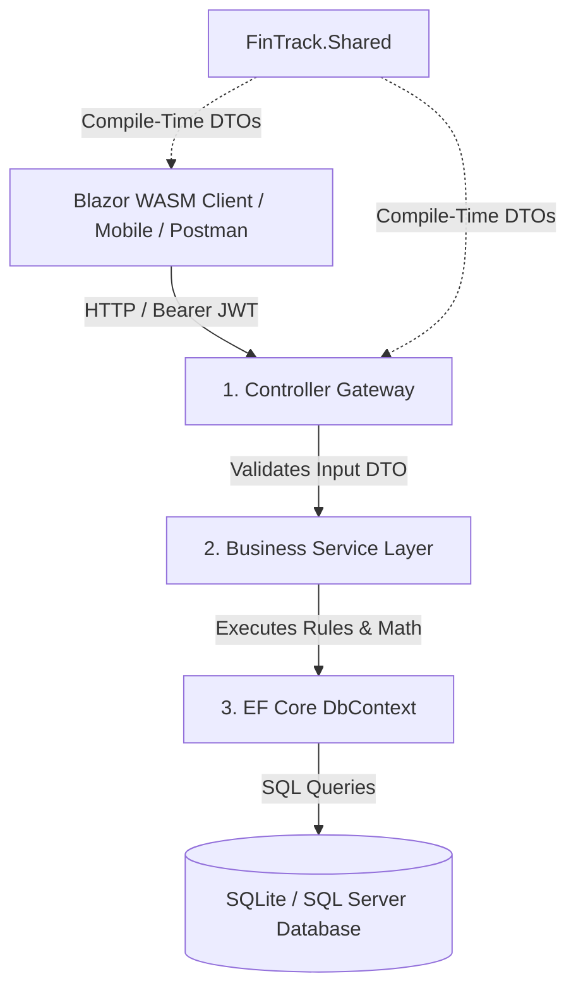

# Master Learning Guide: Building Web APIs with .NET 10 & ASP.NET Core

> **Repository Example:** FinTrack Personal Finance Management System  
> **Target Framework:** .NET 10 (`net10.0`)  
> **Key Libraries:** ASP.NET Core Web API, Entity Framework Core 10, ASP.NET Core Identity, JWT Bearer Authentication, xUnit, Scalar OpenAPI

---

## Table of Contents
1. [Introduction: What is .NET, C#, and ASP.NET Core?](#1-introduction-what-is-net-c-and-aspnet-core)
2. [Architecture Overview: The Layered Pattern in FinTrack](#2-architecture-overview-the-layered-pattern-in-fintrack)
3. [Deep Dive 1: Data Transfer Objects (DTOs) & Shared Libraries](#3-deep-dive-1-data-transfer-objects-dtos--shared-libraries)
4. [Deep Dive 2: Entity Framework Core (EF Core) & Data Persistence](#4-deep-dive-2-entity-framework-core-ef-core--data-persistence)
5. [Deep Dive 3: ASP.NET Core Identity & JWT Authentication](#5-deep-dive-3-aspnet-core-identity--jwt-authentication)
6. [Deep Dive 4: Building REST API Controllers](#6-deep-dive-4-building-rest-api-controllers)
7. [Deep Dive 5: Dependency Injection & Application Lifecycle (`Program.cs`)](#7-deep-dive-5-dependency-injection--application-lifecycle-programcs)
8. [Deep Dive 6: Middleware & Global Exception Handling](#8-deep-dive-6-middleware--global-exception-handling)
9. [Deep Dive 7: Automated Testing with xUnit](#9-deep-dive-7-automated-testing-with-xunit)
10. [Cheat Sheet: Essential `dotnet` CLI Commands](#10-cheat-sheet-essential-dotnet-cli-commands)
11. [Official Microsoft Documentation Sitemap](#11-official-microsoft-documentation-sitemap)

---

## 1. Introduction: What is .NET, C#, and ASP.NET Core?

### A. The Core Concepts
* **C# (C-Sharp):** A modern, strongly-typed, object-oriented programming language designed by Microsoft.
* **.NET:** The cross-platform developer platform that provides the runtime (Common Language Runtime - CLR), base class libraries (collections, file I/O, networking), and execution engine for running C# applications on Linux, macOS, and Windows.
* **ASP.NET Core:** The web framework built on top of .NET for creating REST APIs, web apps (Blazor, Razor Pages), and microservices.

### B. Solution (`.sln` / `.slnx`) vs. Project (`.csproj`)
* **Solution File (`FinTrack.slnx`):** The top-level container file that groups related projects together so an IDE or build server can compile them as a single system.
* **Project File (`.csproj`):** An XML configuration file for an individual project. It declares:
  * Target Framework version: `<TargetFramework>net10.0</TargetFramework>`
  * Package Dependencies: `<PackageReference Include="..." Version="..." />`
  * Project References: `<ProjectReference Include="..." />`

---

## 2. Architecture Overview: The Layered Pattern in FinTrack

In modern web development, we structure code into distinct layers so each component has **one clear responsibility**:



### Layer Responsibilities in `FinTrack`:
1. **`FinTrack.Shared` (Class Library):** Holds DTOs used by both server and client.
2. **`FinTrack.Server` (Web API Application):**
   * **Controllers (`Controllers/`):** Receives HTTP requests, handles status codes (`200 OK`, `201 Created`, `400 Bad Request`, `404 Not Found`).
   * **Services (`Services/`):** Contains pure C# business logic (JWT generation, balance calculations, report aggregations).
   * **Entities & Data (`Models/` & `Data/`):** Maps database tables and executes EF Core LINQ queries.
3. **`FinTrack.Tests` (Testing Project):** Automated xUnit tests for testing business logic in isolation.

---

## 3. Deep Dive 1: Data Transfer Objects (DTOs) & Shared Libraries

### Why DTOs?
Database entities contain internal database details like `PasswordHash`, `SecurityStamp`, and foreign key navigation properties. If you expose database entities directly over HTTP:
1. ❌ You risk leaking sensitive information (e.g. password hashes).
2. ❌ You expose your API to **Over-Posting Attacks** (a client sending hidden fields like `IsAdmin = true`).
3. ❌ UI rendering becomes inefficient.

### DTOs in `FinTrack.Shared`
By placing DTOs in a shared class library (`FinTrack.Shared`), both `FinTrack.Server` and `FinTrack.Client` compile against the exact same data shapes!

```csharp
// Example: TransactionDto.cs
namespace FinTrack.Shared.DTOs.Transaction;

public class TransactionDto
{
    public Guid Id { get; set; }
    public decimal Amount { get; set; }
    public string Type { get; set; } = string.Empty; // "Income" or "Expense"
    public Guid CategoryId { get; set; }
    public string CategoryName { get; set; } = string.Empty; // Denormalized for UI display
    public string Description { get; set; } = string.Empty;
    public DateTime Date { get; set; }
}
```

* **Official Docs:** [Sharing Code in Blazor Class Libraries](https://learn.microsoft.com/en-us/aspnet/core/blazor/components/class-libraries?view=aspnetcore-10.0)

---

## 4. Deep Dive 2: Entity Framework Core (EF Core) & Data Persistence

**Entity Framework Core (EF Core)** is Microsoft's Object-Relational Mapper (ORM). It lets developers work with a database using C# objects instead of writing raw SQL strings (`SELECT * FROM Transactions`).

### A. Domain Entities (`FinTrack.Server/Models/`)
Entities represent database tables:
* `ApplicationUser` (extending `IdentityUser<Guid>`)
* `Category`
* `Transaction`
* `Budget`
* `SavingsGoal`

### B. The DbContext (`FinTrack.Server/Data/FinTrackDbContext.cs`)
`FinTrackDbContext` derives from `IdentityDbContext<ApplicationUser, IdentityRole<Guid>, Guid>`. It manages database connections and maps C# classes to SQL tables via `DbSet<T>` properties:

```csharp
public class FinTrackDbContext : IdentityDbContext<ApplicationUser, IdentityRole<Guid>, Guid>
{
    public FinTrackDbContext(DbContextOptions<FinTrackDbContext> options) : base(options) { }

    public DbSet<Category> Categories => Set<Category>();
    public DbSet<Transaction> Transactions => Set<Transaction>();
    public DbSet<Budget> Budgets => Set<Budget>();
    public DbSet<SavingsGoal> SavingsGoals => Set<SavingsGoal>();

    protected override void OnModelCreating(ModelBuilder builder)
    {
        base.OnModelCreating(builder);

        // Enforce unique constraint: One budget per user, category, and month
        builder.Entity<Budget>()
            .HasIndex(b => new { b.UserId, b.CategoryId, b.Month })
            .IsUnique();

        // Enforce decimal precision for financial fields
        builder.Entity<Transaction>()
            .Property(t => t.Amount)
            .HasPrecision(18, 2);

        // Seed default categories
        builder.Entity<Category>().HasData(
            new Category { Id = Guid.Parse("11111111-1111-1111-1111-111111111111"), Name = "Food", Type = "Expense" },
            new Category { Id = Guid.Parse("66666666-6666-6666-6666-666666666666"), Name = "Salary", Type = "Income" }
        );
    }
}
```

* **Official Docs:** [Entity Framework Core Overview](https://learn.microsoft.com/en-us/ef/core/)

---

## 5. Deep Dive 3: ASP.NET Core Identity & JWT Authentication

### A. ASP.NET Core Identity
Identity handles security user management: password hashing using PBKDF2 with HMAC-SHA256, user registration, and credential validation via `UserManager<ApplicationUser>`.

### B. JWT Bearer Tokens
JWT (JSON Web Token) is a stateless, digitally signed token issued upon successful login:

```text
Header.Payload.Signature
```

1. **`JwtTokenGenerator.cs`:** Creates signed JWT tokens containing claims (`ClaimTypes.NameIdentifier` for `UserId`, `Email`, `Name`).
2. **`AuthService.cs`:** Coordinates user registration and login verification.
3. **`[Authorize]` Attribute:** When placed on a Controller or Endpoint, ASP.NET Core automatically extracts the token from `Authorization: Bearer <token>`, verifies the cryptographic signature, and populates `User.Claims`.

```csharp
// Extracting UserId inside a Controller
private Guid GetUserId()
{
    var userIdClaim = User.FindFirst(ClaimTypes.NameIdentifier)?.Value;
    return Guid.Parse(userIdClaim!);
}
```

* **Official Docs:** [Overview of ASP.NET Core Identity](https://learn.microsoft.com/en-us/aspnet/core/security/authentication/identity?view=aspnetcore-10.0)
* **Official Docs:** [JWT Bearer Authentication](https://learn.microsoft.com/en-us/aspnet/core/security/authentication/social/jwt-bearer?view=aspnetcore-10.0)

---

## 6. Deep Dive 4: Building REST API Controllers

Controllers are HTTP Action Handlers.

### A. Key Controller Annotations
* `[ApiController]`: Enables automatic model state validation (returns `400 Bad Request` if DTO data annotations fail).
* `[Route("api/[controller]")]`: Sets the route prefix (e.g. `/api/transactions`).
* `[Authorize]`: Restricts access to authenticated requests carrying a valid JWT token.
* `[HttpGet]`, `[HttpPost]`, `[HttpPut]`, `[HttpDelete]`: Maps HTTP verbs.
* `[FromBody]`, `[FromQuery]`, `[FromRoute]`: Specifies where request parameters come from.

### B. Controller Action Pattern (`TransactionsController.cs`)
```csharp
[ApiController]
[Route("api/transactions")]
[Authorize]
public class TransactionsController : ControllerBase
{
    private readonly ITransactionService _transactionService;

    public TransactionsController(ITransactionService transactionService)
    {
        _transactionService = transactionService;
    }

    [HttpPost]
    [ProducesResponseType(typeof(TransactionDto), StatusCodes.Status201Created)]
    public async Task<IActionResult> Create([FromBody] CreateTransactionRequest request)
    {
        var userId = GetUserId();
        var (success, dto, errorMessage, errors) = await _transactionService.CreateAsync(userId, request);
        if (!success)
        {
            return BadRequest(new ErrorResponse { Message = errorMessage, Errors = errors });
        }

        return CreatedAtAction(nameof(GetById), new { id = dto!.Id }, dto);
    }
}
```

* **Official Docs:** [Create Web APIs with ASP.NET Core](https://learn.microsoft.com/en-us/aspnet/core/web-api/?view=aspnetcore-10.0)
* **Official Docs:** [Controller Action Return Types](https://learn.microsoft.com/en-us/aspnet/core/web-api/action-return-types?view=aspnetcore-10.0)

---

## 7. Deep Dive 5: Dependency Injection & Application Lifecycle (`Program.cs`)

**Dependency Injection (DI)** is a software design pattern where objects receive their dependencies from an IoC (Inversion of Control) container rather than instantiating them manually (`new Service()`).

### Service Lifetimes in ASP.NET Core:
1. **Transient (`AddTransient`):** Created every time they are requested.
2. **Scoped (`AddScoped`):** Created **once per HTTP request**. (Ideal for `DbContext` and Services!).
3. **Singleton (`AddSingleton`):** Created **once** when the app starts and shared across all requests.

### `Program.cs` Breakdown:
```csharp
var builder = WebApplication.CreateBuilder(args);

// 1. Add Controllers & OpenAPI
builder.Services.AddControllers();
builder.Services.AddOpenApi();

// 2. Register DbContext
builder.Services.AddDbContext<FinTrackDbContext>(options =>
    options.UseSqlite("Data Source=fintrack.db"));

// 3. Register Identity & JWT Authentication
builder.Services.AddIdentityCore<ApplicationUser>()
    .AddEntityFrameworkStores<FinTrackDbContext>();

builder.Services.AddAuthentication(JwtBearerDefaults.AuthenticationScheme)
    .AddJwtBearer(options => { /* Token Validation Parameters */ });

// 4. Register Custom Application Services (Dependency Injection)
builder.Services.AddScoped<IJwtTokenGenerator, JwtTokenGenerator>();
builder.Services.AddScoped<IAuthService, AuthService>();
builder.Services.AddScoped<ITransactionService, TransactionService>();
builder.Services.AddScoped<IBudgetService, BudgetService>();
builder.Services.AddScoped<ISavingsGoalService, SavingsGoalService>();
builder.Services.AddScoped<IDashboardService, DashboardService>();
builder.Services.AddScoped<IReportService, ReportService>();

var app = builder.Build();

// 5. Configure Middleware HTTP Pipeline
app.UseMiddleware<ApiExceptionMiddleware>();
app.UseAuthentication();
app.UseAuthorization();
app.MapControllers();

app.Run();
```

* **Official Docs:** [Dependency Injection in ASP.NET Core](https://learn.microsoft.com/en-us/aspnet/core/fundamentals/dependency-injection?view=aspnetcore-10.0)

---

## 8. Deep Dive 6: Middleware & Global Exception Handling

**Middleware** is software assembled into an application pipeline to handle requests and responses. Each component can perform logic before and after passing the request to the next component.

### `ApiExceptionMiddleware.cs`
Catches unhandled exceptions anywhere in the request pipeline and returns a clean, standardized JSON response:

```csharp
public class ApiExceptionMiddleware
{
    private readonly RequestDelegate _next;

    public ApiExceptionMiddleware(RequestDelegate next) => _next = next;

    public async Task InvokeAsync(HttpContext context)
    {
        try
        {
            await _next(context);
        }
        catch (Exception ex)
        {
            context.Response.ContentType = "application/json";
            context.Response.StatusCode = 500;
            var response = new ErrorResponse { Message = "An unexpected server error occurred." };
            await context.Response.WriteAsync(JsonSerializer.Serialize(response));
        }
    }
}
```

* **Official Docs:** [ASP.NET Core Middleware](https://learn.microsoft.com/en-us/aspnet/core/fundamentals/middleware/?view=aspnetcore-10.0)

---

## 9. Deep Dive 7: Automated Testing with xUnit

Testing ensures code correctness. In `tests/FinTrack.Tests`, we use **xUnit** and EF Core's **In-Memory Database** provider to test services without needing a real database file:

```csharp
public class TransactionServiceTests
{
    private FinTrackDbContext GetInMemoryDbContext()
    {
        var options = new DbContextOptionsBuilder<FinTrackDbContext>()
            .UseInMemoryDatabase(databaseName: Guid.NewGuid().ToString())
            .Options;
        var context = new FinTrackDbContext(options);
        context.Database.EnsureCreated();
        return context;
    }

    [Fact]
    public async Task CreateAsync_ShouldIsolateDataByUserId()
    {
        using var context = GetInMemoryDbContext();
        var service = new TransactionService(context);

        var userA = Guid.NewGuid();
        var userB = Guid.NewGuid();

        await service.CreateAsync(userA, new CreateTransactionRequest { Amount = 100, Type = "Expense", CategoryId = Guid.Parse("11111111-1111-1111-1111-111111111111"), Date = DateTime.UtcNow });

        var userAResult = await service.GetTransactionsAsync(userA, null, null, null, null);
        var userBResult = await service.GetTransactionsAsync(userB, null, null, null, null);

        Assert.Single(userAResult.Items);
        Assert.Empty(userBResult.Items); // Verified Data Isolation!
    }
}
```

* **Official Docs:** [Unit Testing in .NET with xUnit](https://learn.microsoft.com/en-us/dotnet/core/testing/unit-testing-with-dotnet-test)

---

## 10. Cheat Sheet: Essential `dotnet` CLI Commands

| Action | Command Line |
|---|---|
| **Restore Dependencies** | `dotnet restore` |
| **Build Project** | `dotnet build src/FinTrack.Server/FinTrack.Server.csproj` |
| **Run Web API** | `dotnet run --project src/FinTrack.Server` |
| **Run Unit Tests** | `dotnet test tests/FinTrack.Tests/FinTrack.Tests.csproj` |
| **Add EF Core Migration** | `dotnet ef migrations add <Name> --project src/FinTrack.Server` |
| **Update Database** | `dotnet ef database update --project src/FinTrack.Server` |

---

## 11. Official Microsoft Documentation Sitemap

* 📘 [ASP.NET Core Web API Fundamentals](https://learn.microsoft.com/en-us/aspnet/core/web-api/?view=aspnetcore-10.0)
* 📙 [Entity Framework Core Documentation](https://learn.microsoft.com/en-us/ef/core/)
* 📗 [ASP.NET Core Identity Guide](https://learn.microsoft.com/en-us/aspnet/core/security/authentication/identity?view=aspnetcore-10.0)
* 📕 [Blazor WebAssembly Documentation](https://learn.microsoft.com/en-us/aspnet/core/blazor/?view=aspnetcore-10.0)
* 📓 [C# Language Documentation](https://learn.microsoft.com/en-us/dotnet/csharp/)
