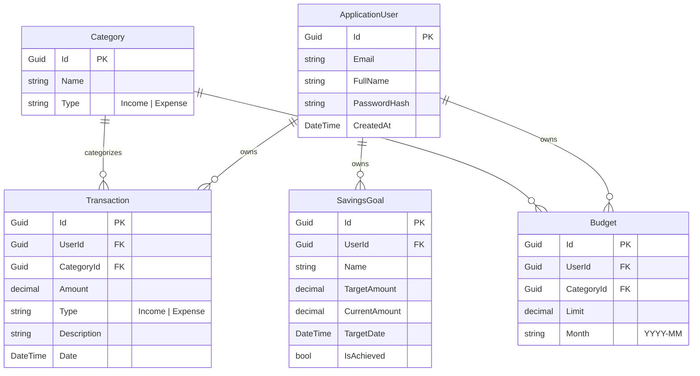

# Backend & Database Architecture Reference — FinTrack

> **Target Platform:** .NET 10 (ASP.NET Core Web API, EF Core 10, ASP.NET Core Identity)  
> **Auth standard:** JWT Bearer + Refresh Tokens (`JsonWebTokenHandler`)

---

## 1. Domain Entities & Database Schema

The database model is managed via EF Core (`FinTrackDbContext`). All data is strictly scoped per authenticated user (`UserId`).



---

## 2. API Contract & Response Formats

### Global Rules & Conventions
1. **Base URL:** `/api`
2. **Currency:** `decimal` with 2 decimal places.
3. **Dates:** ISO 8601 UTC string (`YYYY-MM-DDTHH:mm:ssZ`).
4. **Primary Keys:** `Guid`.
5. **Data Scoping:** Every query/command MUST filter by the logged-in user's `UserId`. Unowned resources return `404 Not Found` to avoid leaking resource existence.

### Standardized Error Envelope Format
All non-2xx error responses follow a uniform shape:

```json
{
  "message": "Validation failed for one or more parameters.",
  "errors": {
    "amount": ["Amount must be greater than zero."],
    "date": ["Transaction date cannot be in the future."]
  }
}
```

---

## 3. Endpoints Matrix

### Auth Endpoints (`/api/auth`)
* `POST /api/auth/register` — Creates user, returns JWT + Refresh Token.
* `POST /api/auth/login` — Authenticates user, returns JWT + Refresh Token.
* `POST /api/auth/refresh` — Validates refresh token, issues new JWT.

### Categories Endpoint (`/api/categories`)
* `GET /api/categories` — Returns seeded master category list (`Food`, `Transport`, `Rent`, `Utilities`, `Entertainment`, `Salary`, `Other`).

### Transactions Endpoints (`/api/transactions`)
* `GET /api/transactions?from=&to=&categoryId=&type=&page=1&pageSize=25` — Paginated transactions.
* `GET /api/transactions/{id}` — Specific transaction.
* `POST /api/transactions` — Create transaction. Validates amount > 0, date ≤ utcNow.
* `PUT /api/transactions/{id}` — Update transaction.
* `DELETE /api/transactions/{id}` — Remove transaction.

### Budgets Endpoints (`/api/budgets`)
* `GET /api/budgets?month=YYYY-MM` — Returns budgets with server-calculated `spent` and `remaining`.
* `POST /api/budgets` — Create budget (enforces unique category limit per month).
* `PUT /api/budgets/{id}` — Update limit.
* `DELETE /api/budgets/{id}` — Delete budget.

### Savings Goals Endpoints (`/api/savings-goals`)
* `GET /api/savings-goals` — Returns savings goals with calculated progress percentage.
* `POST /api/savings-goals` — Create savings target.
* `PUT /api/savings-goals/{id}` — Update target details.
* `POST /api/savings-goals/{id}/contribute` — Add funds directly to goal.
* `DELETE /api/savings-goals/{id}` — Remove savings goal.

### Dashboard Endpoint (`/api/dashboard`)
* `GET /api/dashboard?month=YYYY-MM` — Aggregates total income, total expenses, net balance, 5 recent transactions, and budgets at risk (≥ 80% used).

### Reports Aggregations (`/api/reports`)
* `GET /api/reports/spending-by-category?from=&to=` — Expense breakdown grouped by category with total and percentage share.
* `GET /api/reports/income-vs-expense?from=&to=&granularity=monthly` — Time series points for income, expense, and net totals (ensures zero-filled periods for smooth charting).
